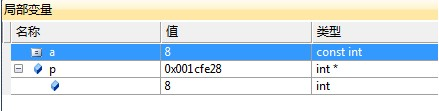

# （1）局部变量及初始化；</br>

* 1 初始化与赋值并不是同一个概念：

初始化：创建变量时赋予其一个初始值。

赋值：把对象（已经创建）的当前值擦除，而用一个新值来代替。

* 2 列表初始化

作为C++11新标准的一部分，用花括号来初始化变量得到了全面应用（在此之前，只是在初始化数组的时候用到）。列表初始化有两种形式，如下所示：

```c++

    int a = {0}; // 列表初始化方式1
    int a{0}; // 列表初始化方式2

```

说明：上述的两种方式都可以将变量a初始化为0。

* 2.1 局限

当对内置类型使用列表初始化时，若初始值存在丢失的风险，编译将报错，如：

```c++
int a = 3.14;   // 正确，虽然会丢失小数部分，但是编译器不报错。
int a = {3.14}; // 错误，因为将会丢失小数部分（其实，g++只是对此提示警告而已，并非错误）。
```

使用g++ 4.8.4对上述两个初始化方式分别进行测试，前者无错误无警告，但是后者提示警告（不是错误！）：

```c++
warning: narrowing conversion of ‘3.1400000000000001e+0’ from ‘double’ to ‘int’ inside { } [-Wnarrowing]

```

* 2.2 拓展

参考资料[1]P39还提到，由花括号括起来的初始值，不仅可以用于初始化变量，还可以用于为对象（旧变量）赋新值。

```c++
int a = 1;   // 定义变量，并且初始化为1
a = {3};     // 为变量a赋新值3
```

* 2.3 用处

可以用在任何需要变量初始化的地方，例如第6章的类成员初始化，以及在for()中定义的变量：

```c++
for (int i{0}; i > 10; i++) {
...
}

```

* 3 拷贝初始化

如果使用等号初始化一个变量，实际上执行的是拷贝初始化(copy initialization)，编译器把等号右侧的初始值拷贝到新创建的对象中去：

```c++
string s1;       // 默认初始化为空字符串
string s2 = s1;  // 拷贝初始化，s2是s1的副本
```

* 4 直接初始化

如果在新创建的变量右侧使用括号将初始值括住（不用等号），则执行的是直接初始化（direct initialization）：

```c++
string s1(); // 直接初始化为空字符串 
string s2("hi"); // 直接初始化
string s3(3, 'c'); // 直接初始化，s2的内容是ccc

```

使用圆括号提供初值是用来构造(construct)对象，因此可以知道，所谓的直接初始化就是显式的调用相应的构造函数。参考资料[1]P262归纳了值初始化的3种情况：

* a）在数组初始化过程中如果提供的初值数量少于数组大小时；
* b）当不使用初始值定义一个局部静态变量时；
* c）当通过T()形式的表达式显式地请求值初始化时（T是类型名）。

explicit构造函数只能用于直接初始化。

* 4.1 特例——vector

vector使用直接初始化时，需要指定一个重复次数：

```c++
vector<string> v1("hello", "world"); // 错误
vector<string> v2{"hello", "world"}; // 正确，可以列表初始化
vector<string> v3(2, "hello");       // 正确，直接初始化要指定一个重复次数，此处v3初始化为"helloheloo"
```

有时候，就算是用的是花括号，也是起到直接初始化的作用（相当于圆括号）：

```c++
vector<string> v4{10}; // 直接初始化，v4有10默认初始化的元素
vector<string> v5{10, "hi"}; // 直接初始化，v5有10个值为“hi”的元素

```

原则：初始化过程会尽可能地把花括号内的值当成是元素初始值列表来处理（列表初始化），只有无法执行列表初始化时才会考虑其他初始化方式。

* 5 默认初始化

    参考资料[1]P40指出，如果定义变量时没有指定初值，则变量被默认初始化，具体值由变量类型及其所在位置决定。参考资料[1]P262归纳了发生默认初始化的3种情况。

* 5.1 内置类型

* 5.1.1 局部变量

* 5.1.1.1 非static局部变量

在函数体内部的内置类型变量（包括指针 ）将不被初始化。与其它内置类型一样，在块作用域内定义的指针如果没有被初始化，也将拥有一个不确定的值。自动对象，也有这个问题。

* 5.1.1.2 static局部变量

参考资料[1]P185指出，如果局部变量没有显式的初始化值，它将执行值初始化（不是默认初始化！），内置类型的局部静态变量初始化为0。

* 5.1.2 全局变量

初始化为0。

* 5.2 类类型

类通过一个特殊的构造函数来控制默认初始化过程，这个类叫做默认构造函数。默认构造函数无需任何实参。每个类各自定义其初始化对象的方式（默认构造函数）。例如，std::string，不管是定义于局部还是全局，都会默认初始化为空。

```c++
string a;                             // 默认初始化为空字符串
tuple<size_t, size_t, size_t> threeD; // 使用tuple的默认构造函数对每个成员进行值初始化
```

* 5.3 例外情况

有些类不支持默认初始化，必须明确地提供初始值。可猜测，此类无默认构造函数。例如下面的定义，将会出现编译错误。

```c++
class Person {

 public:
 Person(string name, string addr):  // 由于自定义了构造函数，编译器
 name(this->name), addr(this->addr) // 不会为Person生成默认构造函数，
 {}           // 而Person中并没有显式定义默认
            // 构造函数，因此Person没有默认
            // 构造函数！
 private:
   const string name;
   const string addr;

}; 

int main(void)
{

 Person p;

}

```

    使用g++4.8.4编译上述代码，提示：

```c++
test.cpp|36 col 9| error: no matching function for call to ‘Person::Person()’
```

* 6 值初始化

值初始化的例子，只提供vector对象容纳元素数量而不提供初始值，此时会创建一个值初始化的元素初值，并把它赋给容器中的所有元素。这个初值由vector对象中元素的类型决定：

```c++
vector<int> ivec(10); // 10个元素，每个都初始化为0

```

对象 默认初始化或 值初始化时自动执行 默认构造函数。

* 7 类成员初始化

  * 7.1 类内初始值

C++11新标准规定，可以为类内数据成员提供一个类内初始值。类内初始值只能使用拷贝初始化和列表初始化（不能直接初始化）。当我们提供一个类内初始值时，必须以符号=或者花括号表示。没有提供类内初始值的成员将被默认初始化。

```c++
class A {
    int a{0};    // 列表初始化为0
    int b = {1}; // 列表初始化为1
    int c = 2;   // 传统初始化为2
    int d;       // 默认初始化，具体值未定义
    int e(3);    // 错误：不能将初始值放在括号内(直接初始化)！ 
};
```

# （2）auto；</br>

* 1. auto简介

* 在早期C/C++中auto的含义是：使用auto修饰的变量，是具有自动存储器的局部变量。
* C++11中，标准委员会赋予了auto全新的含义：auto不再是一个存储类型指示符，而是作为一个新的类型指示符来指示编译器，auto声明的变量必须由编译器在编译时期推导而得。

```c++
void test()
{

 //auto：自动类型推导
 auto a = 10;
 auto b = 2.0;
 auto c = 'a';
 auto d = 'a' + b;

 cout << typeid(a).name() << endl; //int
 cout << typeid(b).name() << endl; //double
 cout << typeid(c).name() << endl; //char
 cout << typeid(d).name() << endl; //double

 //auto e;无法编译，使用auto定义变量时必须对其进行初始化

}

```

使用auto定义变量时必须对其进行初始化，在编译阶段编译器需要根据初始化表达式来推导auto的实际类型。因此auto并非是一种“类型”的声明，而是一个类型声明时的“占位符”，编译器在编译期会将auto替换为变量实际的类型。

* 2. auto的使用规则

* auto与指针和引用结合起来使用
用auto声明指针类型时，用auto和auto*没有任何区别，但用auto声明引用类型时则必须加&。
* 在同一行定义多个变量
当在同一行声明多个变量时，这些变量必须是相同的类型，否则编译器将会报错，因为编译器实际只对第一个类型进行推导，然后用推导出来的类型定义其他变量。

```c++
void test()
{
 int a = 10;
 int b = a;
 int& ra = a;

 //定义指针：*可加可不加
 auto pa = &a;
 auto pb = &b;

 //定义引用：必须加&
 auto rb = b;
 auto c = b; //不是引用

 cout << typeid(pa).name() << endl; //int*
 cout << typeid(pb).name() << endl; //int*
 cout << typeid(ra).name() << endl; //int
 cout << typeid(c).name() << endl;  //int

 rb = 5; //ra是引用a=ra=5
 c = 100; //c不是引用

 int d, e, f;
 //一行定义多个变量时，表达式推导出的类型必须一致
 auto g = 20, h = 20, k = 2.0;
}
```

* 3. auto不能推导的场景

* auto不能作为函数的参数。

 ```c++
// 此处代码编译失败，auto不能作为形参类型，因为编译器无法对a的实际类型进行推导
void TestAuto(auto a)
{}

```

* auto不能直接用来声明数组。

```c++
void TestAuto()
{
 int a[] = {1,2,3};
 auto b[] = {4，5，6};
}
```

为了避免与C++98中的auto发生混淆，C++11只保留了auto作为类型指示符的用法。
auto在实际中最常见的优势用法就是跟以后会讲到的C++11提供的新式for循环，还有lambda表达式等
进行配合使用。

# （3）头文件防卫式声明；</br>

大家知道，我们写.h文件时，通常会加上防卫式声明，有以下两种方式：

* 1. 宏定义

```c++
#ifndef _FILENAME_
#define _FILENAME_
//...
#endif

```

* 2. 编译器指令

```c++
#pragma once
```　

但是，为什么头文件中需要添加这种防卫式声明呢？如果没有这样的声明，会出现怎样的问题。这里，先看一个例子。

-- "Car.h"，代码如下（并没有添加防卫式声明）：
```c++
// Car.h
class Car
{
// ...
};
```

-- "Person.h"，代码如下（包含了Car.h文件）：

```c++
// Person.h
#include "Car.h"
class Person
{
public:

    Car car;

}; 

```

-- 在"main.cpp"中，我们同时include两个头文件：

```c++
// main.cpp
#include "Car.h"
#include "Person.h"
int main(int argc, const char * argv[]) <br>{
    Person p;
}
```

此时，我们会发现编译出错：Redefinition of 'Car'.

可是为什么会出现这样的情况呢？

我们需要知道，在预编译阶段，编译器会把.h文件展开，即main.cpp中的代码可以看做是：

```c++
class Car
{

    // ...

}; 
 
class Car
{

    // ...

}; 
 
class Person
{
public:

    Car car;

}; 
 
int main(int argc, const char * argv[]) {

    Person p;

}

```

所以，我们可以知道防卫式声明的作用是：防止由于同一个头文件被包含多次，而导致了重复定义。

在这两种声明方式中：

　　#ifndef 依赖于宏定义名，当宏已经定义时，#endif之前的代码就会被忽略，但是这里需要注意宏命名重名的问题；

　　#pragma once 只能保证同一个文件不会被编译多次，但是当两个不同的文件内容相同时，仍然会出错。而且这是微软提供的编译器命令，当代码需要跨平台时，需要使用宏定义方式。

# （4）引用；</br>

# （5）常量；</br>

const 是 constant 的缩写，本意是不变的，不易改变的意思。在 C++ 中是用来修饰内置类型变量，自定义对象，成员函数，返回值，函数参数。

C++ const 允许指定一个语义约束，编译器会强制实施这个约束，允许程序员告诉编译器某值是保持不变的。如果在编程中确实有某个值保持不变，就应该明确使用const，这样可以获得编译器的帮助。

* 一、const修饰普通类型的变量

```c++
const int  a = 7; 
int  b = a; // 正确
a = 8;       // 错误，不能改变
```

a 被定义为一个常量，并且可以将 a 赋值给 b，但是不能给 a 再次赋值。对一个常量赋值是违法的事情，因为 a 被编译器认为是一个常量，其值不允许修改。

接着看如下的操作：

实例

```c++
#include<iostream>
 
using namespace std; 
 
int main(void)
{

    const int  a = 7;
    int  *p = (int*)&a;
    *p = 8;
    cout<<a;
    system("pause");

    return 0;

}

```

对于 const 变量 a，我们取变量的地址并转换赋值给 指向 int 的指针，然后利用 *p = 8; 重新对变量 a 地址内的值赋值，然后输出查看 a 的值。



从下面的调试窗口看到 a 的值被改变为 8，但是输出的结果仍然是 7。


从结果中我们可以看到，编译器然后认为 a 的值为一开始定义的 7，所以对 const a 的操作就会产生上面的情况。所以千万不要轻易对 const 变量设法赋值，这会产生意想不到的行为。

如果不想让编译器察觉到上面到对 const 的操作，我们可以在 const 前面加上 volatile 关键字。

Volatile 关键字跟 const 对应相反，是易变的，容易改变的意思。所以不会被编译器优化，编译器也就不会改变对 a 变量的操作。

实例

```c++
#include<iostream>
 
using namespace std;
 
int main(void)
{
    volatile const int  a = 7;
    int  *p = (int*)&a;
    *p = 8;
    cout<<a;
    system("pause");
    return 0;
}
```

输出结果如我们期望的是 8。

* 二、const 修饰指针变量。

const 修饰指针变量有以下三种情况。

* A: const 修饰指针指向的内容，则内容为不可变量。
* B: const 修饰指针，则指针为不可变量。
* C: const 修饰指针和指针指向的内容，则指针和指针指向的内容都为不可变量。
对于 A:

```c++
const int *p = 8; 

```

则指针指向的内容 8 不可改变。简称左定值，因为 const 位于 * 号的左边。

对于 B:

```c++
int a = 8;
int* const p = &a;
*p = 9; // 正确
int  b = 7;
p = &b; // 错误
```

对于 const 指针 p 其指向的内存地址不能够被改变，但其内容可以改变。简称，右定向。因为 const 位于 * 号的右边。

对于 C: 则是 A 和 B的合并

```c++
int a = 8; 
const int * const  p = &a; 

```

这时，const p 的指向的内容和指向的内存地址都已固定，不可改变。

对于 A，B，C 三种情况，根据 const 位于 * 号的位置不同，我总结三句话便于记忆的话："左定值，右定向，const修饰不变量"。

* 三、const参数传递和函数返回值。

对于 const 修饰函数参数可以分为三种情况。

* A：值传递的 const 修饰传递，一般这种情况不需要 const 修饰，因为函数会自动产生临时变量复制实参值。

实例

```c++
#include<iostream>
 
using namespace std;
 
void Cpf(const int a)
{
    cout<<a;
    // ++a;  是错误的，a 不能被改变
}
 
int main(void)
 
{
    Cpf(8);
    system("pause");
    return 0;
}
```

* B：当 const 参数为指针时，可以防止指针被意外篡改。

实例

```c++
#include<iostream>
 
using namespace std; 
 
void Cpf(int *const a)
{

    cout<<*a<<" ";
    *a = 9;

}
 
int main(void)
{

    int a = 8;
    Cpf(&a);
    cout<<a; // a 为 9
    system("pause");

    return 0;

}

```

* C：自定义类型的参数传递，需要临时对象复制参数，对于临时对象的构造，需要调用构造函数，比较浪费时间，因此我们采取 const 外加引用传递的方法。

并且对于一般的 int、double 等内置类型，我们不采用引用的传递方式。

实例

```c++
#include<iostream>
 
using namespace std; 
 
class Test
{
public:

    Test(){}
    Test(int _m):_cm(_m){}
    int get_cm()const
    {
       return _cm;
    }

 
private:

    int _cm;

}; 
 
 
 
void Cmf(const Test& _tt)
{

    cout<<_tt.get_cm();

}
 
int main(void)
{

    Test t(8);
    Cmf(t);
    system("pause");

    return 0;

}
```

结果输出 8。

对于 const 修饰函数的返回值。

Const 修饰返回值分三种情况。

* A：const 修饰内置类型的返回值，修饰与不修饰返回值作用一样。

实例

```c++
#include<iostream>
 
using namespace std; 
 
const int Cmf()
{

    return 1;

}
 
int Cpf()
{

    return 0;

}
 
int main(void)
{

    int _m = Cmf();
    int _n = Cpf();

 

    cout<<_m<<" "<<_n; 
    system("pause"); 

    return 0;

}

```

* B: const 修饰自定义类型的作为返回值，此时返回的值不能作为左值使用，既不能被赋值，也不能被修改。

* C: const 修饰返回的指针或者引用，是否返回一个指向 const 的指针，取决于我们想让用户干什么。

* 四、const修饰类成员函数

const 修饰类成员函数，其目的是防止成员函数修改被调用对象的值，如果我们不想修改一个调用对象的值，所有的成员函数都应当声明为 const 成员函数。

注意：const 关键字不能与 static 关键字同时使用，因为 static 关键字修饰静态成员函数，静态成员函数不含有 this 指针，即不能实例化，const 成员函数必须具体到某一实例。

下面的 get_cm()const; 函数用到了 const 成员函数：

实例

```c++
#include<iostream>
 
using namespace std; 
 
class Test
{
public:

    Test(){}
    Test(int _m):_cm(_m){}
    int get_cm()const
    {
       return _cm;
    }

 
private:

    int _cm;

}; 
 
 
 
void Cmf(const Test& _tt)
{

    cout<<_tt.get_cm();

}
 
int main(void)
{

    Test t(8);
    Cmf(t);
    system("pause");

    return 0;

}
```

如果 get_cm() 去掉 const 修饰，则 Cmf 传递的 const_tt 即使没有改变对象的值，编译器也认为函数会改变对象的值，所以我们尽量按照要求将所有的不需要改变对象内容的函数都作为 const 成员函数。

如果有个成员函数想修改对象中的某一个成员怎么办？这时我们可以使用 mutable 关键字修饰这个成员，mutable 的意思也是易变的，容易改变的意思，被 mutable 关键字修饰的成员可以处于不断变化中，如下面的例子。

实例

```c++
#include<iostream>
using namespace std; 
class Test
{
public:

    Test(int _m,int _t):_cm(_m),_ct(_t){}
    void Kf()const
    {
        ++_cm; // 错误
        ++_ct; // 正确
    }

private:

    int _cm;

    mutable int _ct; 

}; 
 
int main(void)
{

    Test t(8, 7); 

    return 0;

}

```

这里我们在 Kf()const 中通过 ++_ct; 修改_ct 的值，但是通过 ++_cm 修改_cm 则会报错。因为 ++_cm 没有用 mutable 修饰。

constexpr 是 C++11 中增加的关键字，我们可以使用该关键字定义以下对象：

编译期常量；
常量表达式函数；
编译期常量对象。

head1.h

```c++
//head1.h
#ifndef __HEAD1__H__
#define __HEAD1__H__
int g_globalh1 = 8; 
#endif

```

head2.h

```c++
#ifndef __HEAD2__H__
#define __HEAD2__H__
#include "head1.h"
int g_globalh2=5; 
#endif

```

project.cpp

```c++
//project.cpp
#include "head1.h"
#include "head2.h"
#include <iostream>
using namespace std; 

void func(int &ta, int &tb) //注意形参是引用类型
{

 ta = 4; //改变这个值会影响到外界。
 tb = 5;

}

constexpr int func(int abc)
{

 abc = 16;
 return 5;

}

int main()
{

 //一：局部变量及初始化
 //随时用到随时定义。
 for(int i = 0; i < 10;i++) //i的作用域仅仅限制在for语句内
 {
  cout <<i<<endl;
 }
 int abc = 5; //定义的时候初始化
 int abc = {5}; //等号在这里可以有可以没有
 cout<<abc<<endl;
 for(int i = {0};i<10;i++)
 {
  cout<<i<<endl;
 }
 int a[]{11,12,34}; //数组定义及其初始化
 cout<<a[2]<<endl;
 //int abc = 3.5f; //丢了.5，被系统截断
 int abc{3.5f}; //无法编译成功，系统执行了一个从浮点数到整数的转换。
 
 //二：auto;变量的自动类型推断
 //auto可以在声明变量的时候根据变量初始值的类型自动为此变量选择匹配的类型；（声明时要赋予初值[初始化])
 //auto自动类型推断发生在编译期间。所以使用auto不会造成程序效率降低
 auto bvalue = true;//bool
 auto ch = 'a';//char
 auto dv=1.2f;
 auto iv = 5;

 //三：头文件防卫式声明
 cout<<g_globalh1<<endl;
 cout<<g_globalh2<<endl;
 
 //#ifdef,ifndef条件编译
 //#ifndef标识符 当标识符没有定义过（没有用#define定义过），则对程序段进行编译。
 //程序段
 //#endif

 //四：引用
 //引用理解成：为变量起了另外一个名字，一般用&符号表示。起完别名后，这别名和变量本身我们就看成是同一个变量；
 int value = 10;
 int &refval = value;//value的别名就是refval,&在这里不是求地址运算符，只是起标识作用。
      // 定义引用，并不二外占用内存，或者理解为，引用和原变量占用同一块内存
      // 定义引用的时候必须初始化
 refval = 3;
 cout<<value<<endl;
 cout<<refval<<endl;
 
 int &refval2;
 int &refval3 = 10;//引用必须绑定到变量上去，绑定到对象上也可以。不能绑定到常量上去。
 float &refval2=value;//不可以，类型要相同。
 
 int a=3;
 int &b = a;//引用，注意&符号在=号左边
 int *p = &a;//注意&符号在=右边。

 int a=13;
 int b=14;
 cout<<a<<endl;
 cout<<b<<endl;
 func(a,b);
 cout<<a<<endl;
 cout<<b<<endl;

 //五：常量：不变的量
 13;24.5
 //const关键字：表示不变的意思
 const int var=7; //一种承诺，表示这个变量的值我不会去改变(命名常量）。
 var = 15; //编译时报错，编译器会检查这个const承诺
 int &var2=(int&)var;
 var2=18;
 
 cout<<var<<endl;//7
 cout<<var2<<endl;//18

 //constexpr关键字：C++11才引入的，它也是个常量的概念。在编译的时候求值，肯定能提升性能。
 constexpr int var=1;
 int b=5;
 constexpr int var2=b; //不能=变量
 constexpr int var2=func(11); //不能=普通函数

 constexpr int var=3;
 cout<<var<<endl;
 int &var2=(int &)var;
 var2=5;
 cout<<var2<<endl;
 cout<<var<<endl;

 if(var==var2) //调试时两个值相等实际上不等不会执行same
  cout<<"same"<<endl;

```
